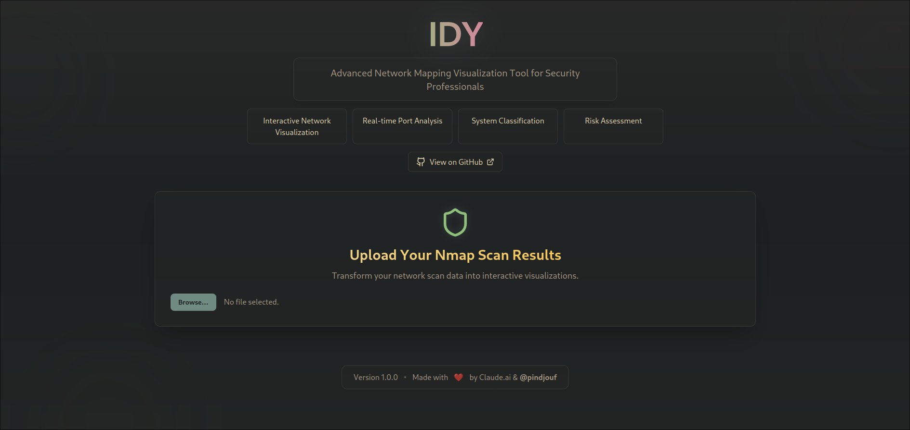

# 👁️ IDY - Because Security Should Look Good 

<div align="center">



[)](LICENSE)
[)](https://github.com/pindjouf/idy/stargazers)
[)](https://github.com/pindjouf/idy/commits/main)

**Transform your boring Nmap scans into pure eye candy! 🍬**

[Live Demo](https://idy.pindjouf.xyz) • [Report Bug](https://github.com/pindjouf/idy/issues) • [Request Feature](https://github.com/pindjouf/idy/issues)

</div>

---

## ✨ Why IDY?

I asked Claude.ai to help me with nmap visualization, but instead of helping me with guidance it made a react app. So I obliged...

### 🎯 Key Features

- 🎨 **Beautiful Visualizations** - Transform raw Nmap data into interactive eye candy
- ⚡ **Real-time Analysis** - Watch your network mapping come alive
- 🔍 **Smart Classification** - Automatic system and service detection
- 🛡️ **Risk Assessment** - Visual risk scoring
- 🌓 **Gruvbox Dark Theme** - Easy on the eyes, heavy on style
- 🖥️ **Modern UI/UX** - Built with React + Tailwind

## 🚀 Quick Start

```bash
git clone https://github.com/pindjouf/idy.git
cd idy
pnpm install
pnpm dev
```

Then open [http://localhost:5173](http://localhost:5173) and watch the magic happen! ✨

## 📊 Usage

1. Run your Nmap scan:
```bash
nmap -sC -sV target.com > scan.txt
```

2. Drop that file into IDY
3. Watch your data transform into eye candy! 🎨

## 🛠️ Tech Stack

- ⚛️ **React**
- 🎨 **Tailwind CSS**
- 🎯 **Vite**
- 📊 **Recharts**
- **Lucide Icons**
- **Shadcn/ui**

## 🤝 Contributing

Got ideas to make IDY better? Send a PR! 

1. Fork it (`https://github.com/pindjouf/idy/fork`)
2. Create your feature branch (`git checkout -b feature/AmazingFeature`)
3. Commit your changes (`git commit -m 'Add some AmazingFeature'`)
4. Push to the branch (`git push origin feature/AmazingFeature`)
5. Open a Pull Request

## License

This project is licensed under the WTFPL License - see the [LICENSE](LICENSE) file for details.

---

<div align="center">

### Star the repo if you're feeling the vibe! ⭐

Made with 🔥 by security enthusiasts, for security enthusiasts

</div>

